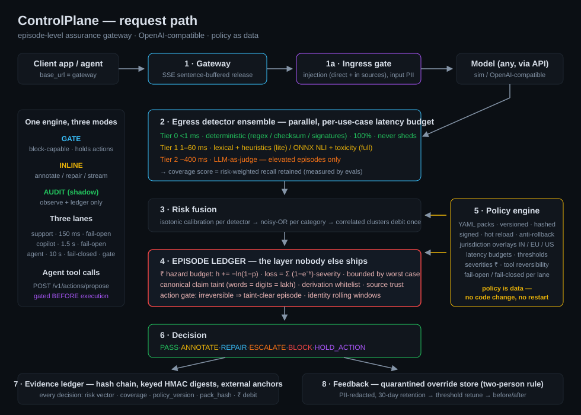

# ControlPlane architecture

## Design decisions and their reasons

| Decision | Reason |
|---|---|
| **Episode, not response, as the unit of governance** | The Round 2 brief names compounding multi-turn/agent risk explicitly; no shipping guardrail governs it. Response-level checking is kept (Tiers 0–2) but treated as commodity. |
| **Hazard-based ₹ budget** (`h += −ln(1−p)`, loss `= Σ(1−e⁻ʰ)·sev`) | Naive per-turn expected-loss summing can exceed the worst possible loss. Hazard math is bounded, monotone, and converts to "P(at least one real failure)" — a coherent episode-level statement. |
| **Canonical values for taint, not surface strings** | "₹1,20,000" = "one point two lakh" = 120000. String matching is defeated by any reformatting — canonicalization survives the obvious adversarial probe. |
| **Derivation whitelist** | Models legitimately derive values (sums, GST, discounts). Tainting them would flood the gate with false holds; each derivation is logged with its formula instead. |
| **Irreversible ⇒ taint-clear episode (not just clean args)** | The dominant miss of arg-only gating: a pristine `transfer(amount=45000)` resting on a fabricated "balance covers it" claim. We cannot read model reasoning (API-only), so the episode's evidence state must be clean — conservative by construction. |
| **Tier 0 = regex/checksum only** | NER does not fit a <5 ms deterministic tier; claiming so invites a fatal Q&A moment. Name detection lives in Tier 1 with its measured latency. |
| **Coverage = risk-weighted recall retained** | "62% of detectors ran" is meaningless; "an estimated 62% of catchable failures were catchable" is a risk statement. Weights are measured by the eval suite. |
| **Degraded coverage debits MORE** | Otherwise load (or an attacker inducing load) makes episodes look safer exactly when checking is weakest. |
| **Two probabilities per category** | Decision thresholds use calibrated detection confidence (fitted on the eval distribution); the ₹ ledger uses the deployment-base-rate-shifted probability, so expected loss is not overstated by the eval's inflated failure prior. |
| **Fail-open vs fail-closed as policy** | A checker fault must not take the storefront down, and must never let unchecked content into a regulated flow. One flag per lane. |
| **Policy signing + anti-rollback + last-known-good** | A validly-signed *old* pack replayed is a downgrade attack; version monotonicity refuses it. An unparseable pack never takes effect. |
| **HMAC content digests in the ledger** | Bare hashes of low-entropy PII (10-digit phones) are brute-forceable; keyed digests are not reversible from ledger possession alone. |
| **Single-writer ledger queue + WAL** | A hash chain needs strictly serialized writes; the queue makes correctness structural and survives the load test. |
| **Replay-first demo (`cp_sim` fixtures)** | Live LLMs are nondeterministic and venues have hostile Wi-Fi. Fixtures key on the *request*, so a jurisdiction switch changes *decisions* on identical content — which is the demo. |

## What is honestly a prototype shortcut

- Anti-rollback high-water mark is per-process memory (production: anchored in the ledger).
- Episode store is in-process (production: shardable by `episode_id`).
- Ledger anchoring appends to a local checkpoint file (production: RFC 3161 / object-lock).
- OpenTelemetry is a roadmap item; telemetry is in-app counters on `/admin/metrics`.
- The "agent" in demos is a scripted tool-call harness; gating works identically for real agent frameworks via `/v1/actions/propose`.
